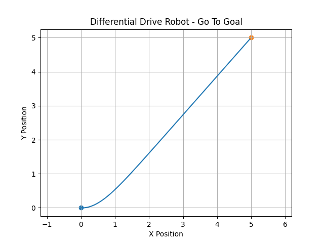
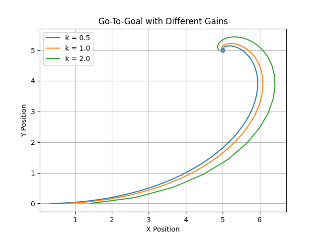

# Differential Drive Robot – Go-To-Goal Simulation

## 📌 Overview
This project simulates a differential drive mobile robot navigating toward a target using a proportional controller.

The robot:
- Computes distance and heading error
- Adjusts angular velocity
- Converges smoothly to a goal position

This project demonstrates core robotics concepts:
- Kinematic modeling
- Proportional control
- Path visualization
- Error analysis

---

## ⚙️ How It Works

The robot state is defined as:

x, y, θ

Control laws:

v = constant linear velocity  
ω = k * heading_error  

Where:
- k = proportional gain
- heading_error = angle to goal − current heading

---

## 📊 Features

- Differential drive kinematic model
- Real-time trajectory simulation
- Goal convergence behavior
- Tunable gain parameter
- Path visualization using matplotlib

---

## 🚀 How To Run

1. Install dependencies:

```
pip install -r requirements.txt
```

2. Run simulation:

```
python differential_drive_sim.py
```

---

## 📷 Example Output


---

## 🔧 Gain Tuning Analysis

To analyze controller performance, the simulation was executed with different proportional gains:

- k = 0.5
- k = 1.0
- k = 2.0

### 📊 Observations

- Lower gain (k = 0.5) results in slower convergence but smoother motion.
- Medium gain (k = 1.0) provides balanced performance.
- Higher gain (k = 2.0) reaches the goal faster but introduces sharper curvature.

This demonstrates the trade-off between stability and responsiveness in proportional control systems used in mobile robotics.



## 🧠 Skills Demonstrated

- Python programming
- Robotics kinematics
- Control systems fundamentals
- Simulation & visualization
- Git & GitHub workflow

---

## 📌 Future Improvements

- Obstacle avoidance
- PID control
- Animation instead of static plot
- ROS implementation

---

## 👤 Author
Keara Kingsellers